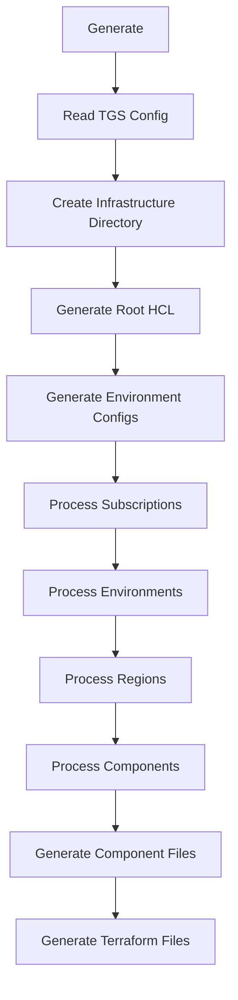
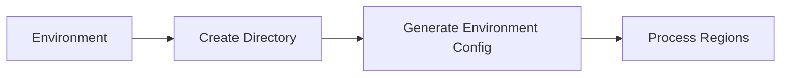
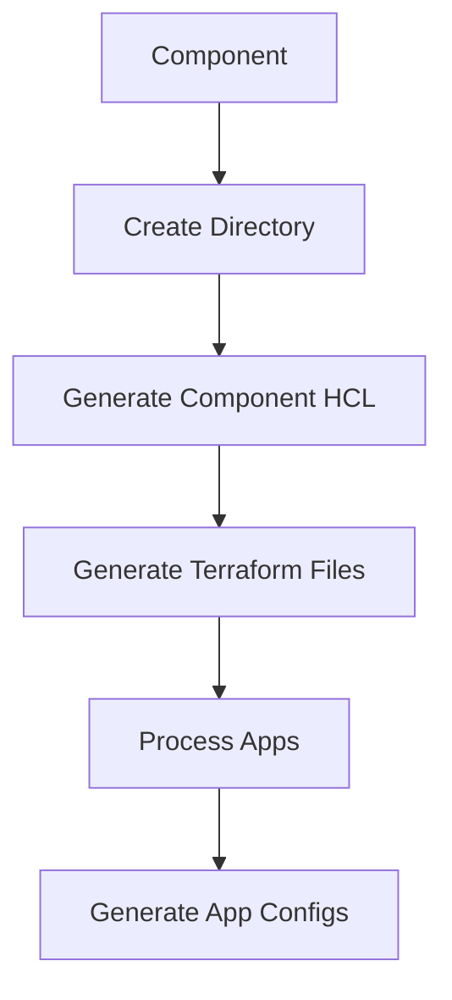

# Terragrunt Scaffolder Generation Process

This document explains how the `generate` command works in the Terragrunt Scaffolder, detailing the code flow and file generation process.

## Overview

The generation process follows a hierarchical structure that mirrors the Azure infrastructure organization:
- Subscriptions
  - Regions
    - Environments
      - Components
        - Apps (optional)

## Code Flow Diagram



## Detailed Process

### 1. Initial Setup
- The process starts in `scaffold.go` with the `Generate()` function
- Reads the TGS configuration from `tgs.yaml`
- Creates the `.infrastructure` directory structure

### 2. Configuration Generation
- Generates `root.hcl` with remote state configuration
- Creates environment configuration files in `.infrastructure/config/`
  - `global.hcl` with project-wide settings
  - Environment-specific configs (dev, test, stage, prod)

### 3. Subscription Processing
For each subscription in the TGS config:


### 4. Environment Processing
For each environment in a subscription:


### 5. Region Processing
For each region in an environment:


### 6. Component Processing
For each component in a region:


### 7. File Generation Details

#### Component Files
- `component.hcl`: Contains component-specific configuration
- `main.tf`: Generated from provider schema
- `variables.tf`: Generated from provider schema
- `provider.tf`: Contains provider configuration

#### App Files (if applicable)
- `terragrunt.hcl`: App-specific configuration
- Inherits from component configuration

## Key Functions

### Core Generation Functions
- `Generate()`: Main entry point
- `generateRootHCL()`: Creates root configuration
- `generateEnvironmentConfigs()`: Creates environment configs
- `generateComponents()`: Generates component files
- `generateTerraformFiles()`: Generates Terraform files

### Helper Functions
- `createFile()`: Creates files with content
- `getResourceTypeAbbreviation()`: Gets resource type abbreviations
- `generateDependencyBlocks()`: Creates dependency blocks
- `generateEnvConfigInputs()`: Generates environment-specific inputs

## File Structure Generated

```
.infrastructure/
├── config/
│   ├── global.hcl
│   ├── dev.hcl
│   ├── test.hcl
│   ├── stage.hcl
│   └── prod.hcl
├── _components/
│   └── [component_name]/
│       ├── component.hcl
│       ├── main.tf
│       ├── variables.tf
│       └── provider.tf
├── [subscription]/
│   ├── subscription.hcl
│   └── [region]/
│       ├── region.hcl
│       └── [environment]/
│           ├── environment.hcl
│           └── [component]/
│               ├── terragrunt.hcl
│               └── [app]/
│                   └── terragrunt.hcl
└── root.hcl
```

## Validation Process

After generation, the code validates:
1. HCL syntax of all generated files
2. Configuration consistency
3. Dependency relationships
4. Resource naming conventions

## Error Handling

The generation process includes comprehensive error handling:
- Directory creation failures
- File generation errors
- Configuration validation errors
- Schema fetching errors
- Dependency resolution errors

## Dependencies

The process relies on several key dependencies:
- Terraform provider schemas
- Environment configurations
- Component definitions
- Resource naming conventions
- Dependency relationships 