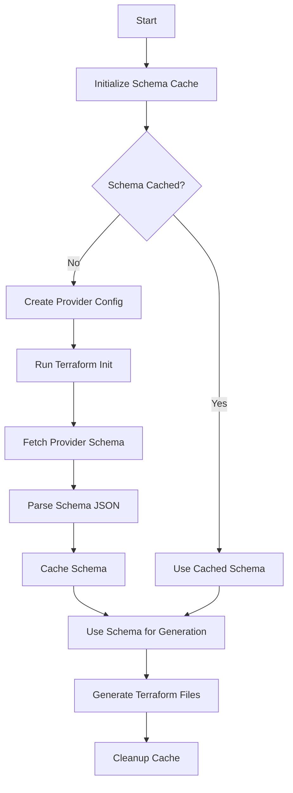

# Azure Provider Schema Querying Process

This document explains how the Terragrunt Scaffolder queries and uses the Azure provider schema to generate accurate Terraform configurations.

## Overview

The provider schema querying process is a crucial part of the generation process that ensures the generated Terraform configurations are accurate and up-to-date with the Azure provider's schema. This process involves caching, fetching, and utilizing the provider schema to generate proper resource configurations.

## Process Flow



## Detailed Implementation

### 1. Schema Cache Initialization

The process begins by creating a temporary directory for caching the provider schema:

```go
func initSchemaCache() (*SchemaCache, error) {
    // Creates a temporary directory for terraform schema cache
    tmpDir, err := os.MkdirTemp("", "tf-schema-cache")
    if err != nil {
        return nil, fmt.Errorf("failed to create temp dir: %w", err)
    }

    schemaCache = &SchemaCache{
        CachePath: tmpDir,
    }
    return schemaCache, nil
}
```

### 2. Provider Schema Fetching

The main function that handles fetching the provider schema:

```go
func fetchProviderSchema(provider, version, resource string) (*ProviderSchema, error) {
    // Initialize or get existing cache
    cache, err := initSchemaCache()
    if err != nil {
        return nil, err
    }

    // Check if schema is already cached
    if cache.Schema != nil {
        return cache.Schema, nil
    }

    // Create provider.tf in cache directory with specified version
    providerConfig := fmt.Sprintf(`
terraform {
  required_providers {
    azurerm = {
      source  = "hashicorp/azurerm"
      version = "%s"
    }
  }
}

provider "azurerm" {
  features {}
}`, version)

    // Write provider config to temporary directory
    providerPath := filepath.Join(cache.CachePath, "provider.tf")
    if err := os.WriteFile(providerPath, []byte(providerConfig), 0644); err != nil {
        return nil, fmt.Errorf("failed to write provider.tf: %w", err)
    }

    // Initialize Terraform in cache directory
    cmd := exec.Command("terraform", "init")
    cmd.Dir = cache.CachePath
    if out, err := cmd.CombinedOutput(); err != nil {
        return nil, fmt.Errorf("terraform init failed: %s: %w", string(out), err)
    }

    // Fetch provider schema using Terraform CLI
    cmd = exec.Command("terraform", "providers", "schema", "-json")
    cmd.Dir = cache.CachePath
    out, err := cmd.Output()
    if err != nil {
        return nil, fmt.Errorf("terraform providers schema failed: %w", err)
    }

    // Parse schema JSON
    var schema ProviderSchema
    if err := json.Unmarshal(out, &schema); err != nil {
        return nil, fmt.Errorf("failed to unmarshal schema: %w", err)
    }

    // Cache the schema for future use
    cache.Schema = &schema
    return &schema, nil
}
```

### 3. Schema Structure

The provider schema is structured as follows:

```go
type ProviderSchema struct {
    ProviderSchema map[string]struct {
        ResourceSchemas map[string]struct {
            Block struct {
                Attributes map[string]SchemaAttribute `json:"attributes"`
                BlockTypes map[string]struct {
                    Block struct {
                        Attributes map[string]SchemaAttribute `json:"attributes"`
                    } `json:"block"`
                    NestingMode string `json:"nesting_mode"`
                } `json:"block_types"`
            } `json:"block"`
        } `json:"resource_schemas"`
    } `json:"provider_schemas"`
}

type SchemaAttribute struct {
    Type        interface{} `json:"type"`
    Required    bool        `json:"required"`
    Optional    bool        `json:"optional"`
    Computed    bool        `json:"computed"`
    Description string      `json:"description"`
}
```

### 4. Usage in Generation

The schema is used to:
- Generate accurate `main.tf` files with proper resource configurations
- Create appropriate `variables.tf` files with correct variable types and descriptions
- Validate required and optional fields
- Generate smart defaults for common fields

### 5. Error Handling and Fallbacks

If schema fetching fails, the system falls back to generating basic Terraform files:

```go
if schema != nil {
    mainContent = generateMainTF(comp, schema)
} else {
    mainContent = fmt.Sprintf(`
resource "%s" "this" {
  name                = var.name
  resource_group_name = var.resource_group_name
  location            = var.location
  tags                = var.tags
}`, comp.Source)
}
```

### 6. Cleanup

After generation is complete, the temporary cache directory is cleaned up:

```go
func cleanupSchemaCache() {
    if schemaCache != nil {
        // Clean up .terraform directory
        tfDir := filepath.Join(schemaCache.CachePath, ".terraform")
        if err := os.RemoveAll(tfDir); err != nil {
            fmt.Printf("Warning: failed to remove .terraform directory: %v\n", err)
        }
        // Clean up cache directory
        if err := os.RemoveAll(schemaCache.CachePath); err != nil {
            fmt.Printf("Warning: failed to remove cache directory: %v\n", err)
        }
    }
}
```

## Benefits

1. **Accuracy**: Ensures generated configurations match the current Azure provider schema
2. **Efficiency**: Caches schema to avoid repeated fetches
3. **Maintainability**: Automatically updates with provider version changes
4. **Reliability**: Includes fallback mechanisms for error cases

## Dependencies

- Terraform CLI installed and available in PATH
- Internet access to download provider plugins
- Sufficient disk space for temporary cache
- Write permissions in temporary directory 